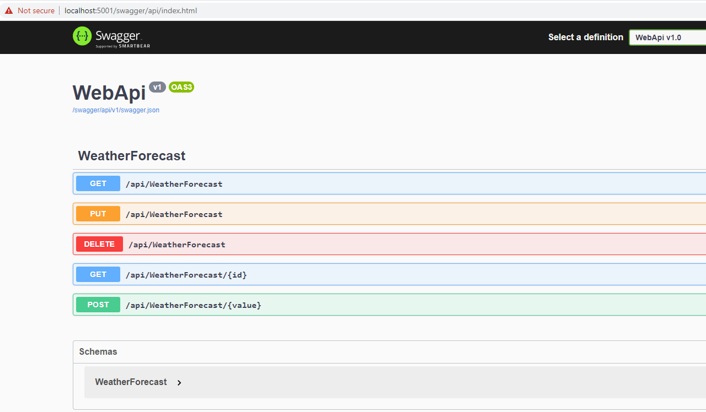

# Windows Service Host

**Hosting a .NET 5 WebAPI in a Windows Service**

This project serves as a template to scaffold your Swagger Web API projects using .net 5 and hosting it in a Windows Service. As it's built using only .net 5, you can launch the project locally on IIS Express, as a command line tool or as a windows service. Using the windows service approach will let you host it on your server without having to use IIS.

### Create the service

```powershell
C:\>sc create HostedService binpath=C:\WindowsServiceHostTemplate\bin\Debug\net5.0\WindowsServiceHostTemplate.exe
[SC] CreateService SUCCESS

C:\WINDOWS\system32>sc start HostedService
```

### Starting the solution as a console app

You can run the application as a simple console app and see the same results:

```powershell
C:\WindowsServiceHostTemplate\bin\Debug\net5.0>WindowsServiceHostTemplate.exe
info: WindowsServiceHostTemplate.Worker[0]
      Worker running at: 11/18/2020 20:18:42 +00:00
[20:18:42 INF] Starting...
info: WindowsServiceHostTemplate.Worker[0]
      Worker running at: 11/18/2020 20:18:43 +00:00
[20:18:43 INF] Worker running at: 11/18/2020 20:18:43 +00:00
info: WindowsServiceHostTemplate.Worker[0]
      Worker running at: 11/18/2020 20:18:44 +00:00
[20:18:44 INF] Worker running at: 11/18/2020 20:18:44 +00:00
[info20:18:44: Microsoft.Hosting.Lifetime[0]
      Now listening on: http://localhost:5000
 INF] Now listening on: http://localhost:5000
[info: Microsoft.Hosting.Lifetime[0]
      Now listening on: https://localhost:5001
20:18:44 INF] Now listening on: https://localhost:5001
[info: Microsoft.Hosting.Lifetime[0]
      Application started. Press Ctrl+C to shut down.
20:18:44 INF] Application started. Press Ctrl+C to shut down.
[info20:18:44: Microsoft.Hosting.Lifetime[0]
      Hosting environment: Production
 INF] Hosting environment: Production
[info20:18:44: Microsoft.Hosting.Lifetime[0]
      Content root path: C:\WindowsServiceHostTemplate\bin\Debug\net5.0
 INF] Content root path: C:\WindowsServiceHostTemplate\bin\Debug\net5.0
info[: WindowsServiceHostTemplate.Worker[0]
      Worker running at: 11/18/2020 20:18:45 +00:00
20:18:45 INF] Worker running at: 11/18/2020 20:18:45 +00:00
[info20:18:46: WindowsServiceHostTemplate.Worker[0]
      Worker running at: 11/18/2020 20:18:46 +00:00
 INF] Worker running at: 11/18/2020 20:18:46 +00:00
info[: WindowsServiceHostTemplate.Worker[0]
      Worker running at: 11/18/2020 20:18:47 +00:00
```

### Navigate to the API

Once the application is running, navigate here -> <https://localhost:5001/api/weatherforecast> and you'll see the data.

And also here for the Swagger API -> <https://localhost:5001/swagger/api/index.html>



### Packages Used

```xml
<PackageReference Include="Serilog" Version="2.10.0" />
<PackageReference Include="Swashbuckle.AspNetCore" Version="5.6.3" />
<PackageReference Include="Swashbuckle.AspNetCore.Annotations" Version="5.6.3" />
<PackageReference Include="Microsoft.Extensions.Hosting.WindowsServices" Version="5.0.0" />
<PackageReference Include="Serilog.AspNetCore" Version="3.4.0" />
<PackageReference Include="Serilog.Sinks.Console" Version="3.1.1" />
<PackageReference Include="Swashbuckle.AspNetCore.Swagger" Version="5.6.3" />
<PackageReference Include="Microsoft.AspNetCore.Mvc.NewtonsoftJson" Version="5.0.0" />
```
